# Diagrama de Classes do Juristack

O diagrama abaixo foi extraído da estrutura atual do projeto Laravel e destaca as classes centrais do domínio e da camada de aplicação.

```mermaid
classDiagram
    direction LR

    class User {
        +id
        +name
        +email
        +password
        +processosMonitorados()
        +tasks()
    }

    class Customer {
        +id
        +name
        +cnp
        +email
        +mobile_phone
        +tags
        +files()
        +formatarCpf()
        +formatarCnpj()
    }

    class CustomerFile {
        +id
        +customer_id
        +path
        +original_name
        +mime
        +size
        +customer()
    }

    class DocumentTemplate {
        +id
        +title
        +type
        +description
        +date
        +content
        +documents()
        +getPlaceholders()
        +placeholderLabel()
    }

    class Document {
        +id
        +title
        +type
        +document_link
        +form_link
        +document_template_id
        +customer_id
        +template()
        +customer()
    }

    class Event {
        +id
        +user_id
        +title
        +starts_at
        +ends_at
        +location
        +is_public
        +user()
    }

    class Task {
        +id
        +title
        +description
        +status
        +users()
    }

    class TaskUser {
        +task_id
        +user_id
    }

    class DatajudProcesso {
        +id
        +user_id
        +datajud_id
        +tribunal
        +numero_processo
        +data_ajuizamento
        +grau
        +datahora_ultima_atualizacao
        +payload
        +assuntos()
        +movimentos()
    }

    class DatajudAssunto {
        +id
        +processo_id
        +codigo
        +nome
        +processo()
    }

    class DatajudMovimento {
        +id
        +processo_id
        +codigo
        +nome
        +data_hora
        +complementos()
        +processo()
    }

    class DatajudMovimentoComplemento {
        +id
        +movimento_id
        +codigo
        +descricao
        +valor
        +nome
        +movimento()
    }

    class ProcessoMonitor {
        +id
        +user_id
        +processo_id
        +tribunal
        +numero_processo
        +ultima_verificacao
        +ultima_atualizacao_datajud
        +ativo
        +usuario()
        +processo()
    }

    class Enterprise {
        +id
        +name
        +cnp
    }

    class CustomerController {
        +index()
        +store()
        +show()
        +update()
        +destroy()
        +uploadForCustomer()
        +downloadFile()
        +destroyFile()
        +uploadFiles()
    }

    class DocumentController {
        +listDocuments()
        +showDocument()
        +createDocument()
        +updateDocument()
        +destroyDocument()
        +download()
        +generateDocument()
        +createForm()
        +showForm()
        +updateForm()
    }

    class DocumentTemplateController {
        +index()
        +store()
        +show()
        +update()
        +destroy()
        +showFillForm()
        +generateDocument()
        +customerToPlaceholders()
    }

    class EventController {
        +index()
        +store()
        +show()
        +update()
        +destroy()
    }

    class TaskController {
        +index()
        +store()
        +update()
        +destroy()
        +updateStatus()
        +updateAssignee()
        +users()
    }

    class DashboardController {
        +index()
    }

    class DataJudController {
        +salvos()
        +monitorados()
        +pesquisar()
        +apiSearch()
        +salvarProcesso()
        +showSaved()
        +atualizarProcesso()
        +deleteSaved()
    }

    class DataJudService {
        +normalizeProcessNumber()
        +tribunals()
        +searchAll()
        +searchByProcess()
        +searchByLawyer()
    }

    class DatajudPersistService {
        +salvarProcesso()
        -normalizeDate()
    }

    class VerificarAtualizacoesProcessos {
        +handle()
    }

    class ProcessoAtualizadoNotification {
        +via()
        +toMail()
        +toArray()
    }

    class DataJudAPI {
        <<external>>
        +CNJ DataJud
    }

    User "1" --> "0..*" Event : possui
    User "1" --> "0..*" ProcessoMonitor : monitora
    User "0..*" -- "0..*" Task : atribuido
    TaskUser .. Task : pivot
    TaskUser .. User : pivot

    Customer "1" --> "0..*" CustomerFile : armazena
    Customer "0..1" <-- "0..*" Document : vincula
    DocumentTemplate "1" --> "0..*" Document : gera

    DatajudProcesso "1" --> "0..*" DatajudAssunto : contem
    DatajudProcesso "1" --> "0..*" DatajudMovimento : contem
    DatajudMovimento "1" --> "0..*" DatajudMovimentoComplemento : detalha
    ProcessoMonitor "0..*" --> "1" DatajudProcesso : referencia

    CustomerController ..> Customer : usa
    CustomerController ..> CustomerFile : usa
    DocumentController ..> Document : usa
    DocumentController ..> DocumentTemplate : usa
    DocumentController ..> Customer : consulta
    DocumentTemplateController ..> DocumentTemplate : usa
    DocumentTemplateController ..> Document : cria
    DocumentTemplateController ..> Customer : preenche
    EventController ..> Event : usa
    TaskController ..> Task : usa
    TaskController ..> User : usa
    DashboardController ..> Customer : agrega
    DashboardController ..> CustomerFile : agrega
    DashboardController ..> ProcessoMonitor : agrega

    DataJudController ..> DataJudService : consulta
    DataJudController ..> DatajudPersistService : persiste
    DataJudController ..> DatajudProcesso : gerencia
    DataJudController ..> ProcessoMonitor : atualiza

    DataJudService ..> DataJudAPI : consome
    DatajudPersistService ..> DatajudProcesso : grava
    DatajudPersistService ..> DatajudAssunto : grava
    DatajudPersistService ..> DatajudMovimento : grava
    DatajudPersistService ..> DatajudMovimentoComplemento : grava

    VerificarAtualizacoesProcessos ..> ProcessoMonitor : verifica
    VerificarAtualizacoesProcessos ..> DataJudService : consulta
    VerificarAtualizacoesProcessos ..> DatajudPersistService : atualiza
    VerificarAtualizacoesProcessos ..> ProcessoAtualizadoNotification : dispara
    ProcessoAtualizadoNotification ..> ProcessoMonitor : representa
```

## Leitura rápida

- O núcleo funcional do sistema está dividido em quatro áreas: `Clientes`, `Documentos`, `Tarefas/Agenda` e `DataJud`.
- `DataJudController`, `DataJudService` e `DatajudPersistService` formam o fluxo de consulta externa, persistência local e monitoramento de processos.
- `DocumentTemplate` funciona como classe-molde; `Document` é a instância gerada ou cadastrada a partir desse molde.
- `Enterprise` existe no código, mas hoje aparece isolada, sem relacionamentos explícitos nos modelos e controladores principais.
